## Filesystem erstellen mit Buildroot

* Buildroot Release herunterladen und entpacken:
```
wget https://buildroot.org/downloads/buildroot-2015.11.1.tar.gz
tar -xzf buildroot-2015.11.1.tar.gz
```

* Die Buildroot Konfiguration starten und die nachfolgenden Parameter aktivieren.
```
cd buildroot-2015.11.1/
make menuconfig
```
  * Target options:
    - Target Architecture: _ARM (little endian)_
    - Target Architecture Variant: _cortex-_A5
    - Target ABI: _EABIhf_
    - Floating point strategy: _VFPv4-D16_
  * Toolchain:
    - Toolchain type: _External toolchain_
    - Toolchain: _Custom toolchain_
    - Toolchain path:  _/usr/local/xtools/arm-cortexa5-linux-uclibcgnueabihf_
    - External toolchain gcc version: _5.x_
    - External toolchain kernel headers series: _4.3.x_
    - External toolchain C library: _uClibc_
    - _Toolchain has WCHAR support?_ auswählen
    - _Toolchain has C++ support?_ auswählen
    - _Register toolchain within Eclipse Buildroot plug-in_  auswählen
  * System configuration:
    - Enable root login with password
    - (EinPasswort) Root password
  * Target Packages:
    - Debugging, profiling and benchmark:
      - _gdb_
    - Filesystem and Flash utilities:
      - _mtd, jffs and ubi_
    - Networking applications:
      - gesftpserver
      - dropbear
  * Filesystem images:
    - _tar the root filesystem_ auswählen
    - _ubifs root filesystem_
      - (0x1f000) logical eraseblock
      - (0x800) minimum I/O unit size
      - (1000) maximum logical eraseblock count


* Das erzeugte rootfs.ubifs, wie im Labbook beschrieben, vom U-Boot aus auf das Root-Volume schreiben und neustarten.
```
mtdparts
ubi part UBI
tftp 0x22000000 rootfs.ubifs
ubi writevol 0x22000000 rootfs ${filesize}
```

# Debugging mit Eclipse
## Eclipse installieren
Auf der [Eclipse-Seite](http://www.eclipse.org/downloads/packages/eclipse-ide-cc-developers/mars2) das passende Paket runterladen und gemäß Anleitung entpacken.


## Ein Cross-Compile-Projekt einrichten
Ein neues "Hello World"  Beispielprojekt anlegen und "Cross GCC" als Toolchain auswählen.

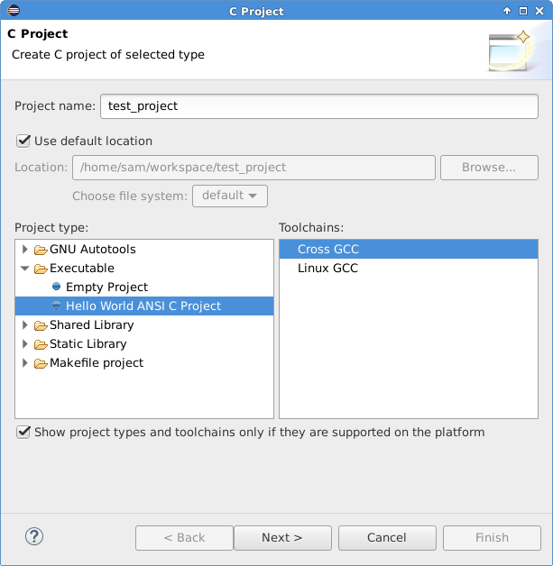

Benötigte Informationen ausfüllen und auf Next klicken

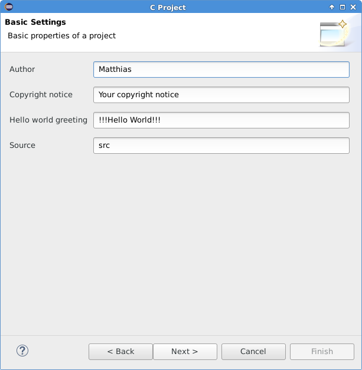

Die Default Einstellungen sind in Ordnung, auf Next klicken.

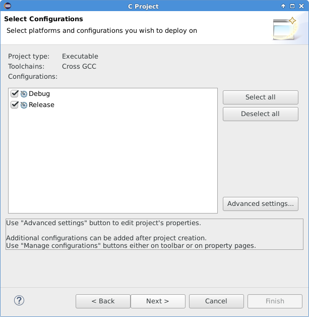

Hier im Dialog den Cross-Compiler Prefix (wir hatten in den Labs arm-linux- als Alias benutzt) und den kompletten Pfad zum Cross-Compiler eintragen. Auf Finish klicken.

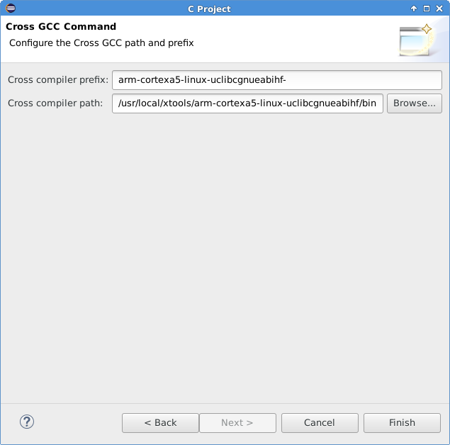

Das Beispielprojekt
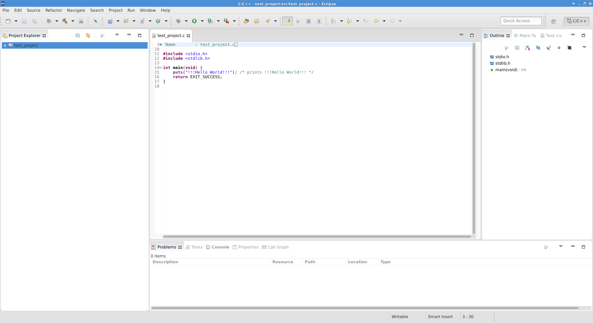

Baut man das Projekt mit "strg + b" oder einen Klick auf "Project -> Build All" kann man in der Konsole sehen, dass die Cross-Compiler-Toolchain verwendet wird.
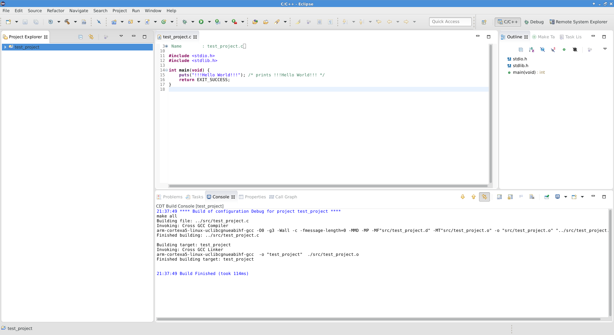

## Eclipse mit dem target verbinden

Mittels "Window -> Perspective -> Open Perspective -> Other" die Auswahlliste der zur Verfügung stehenden perspektiven aufrufen. Dort den "Remote System Explorer" auswählen.

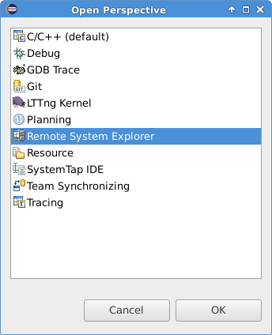

In der sich öffnenden Perspective im Tab "Remote Systems" einen Rechtsklick auf "Local" ausführen und im sich öffnenden Kontextmenü "New -> Connection" wählen.

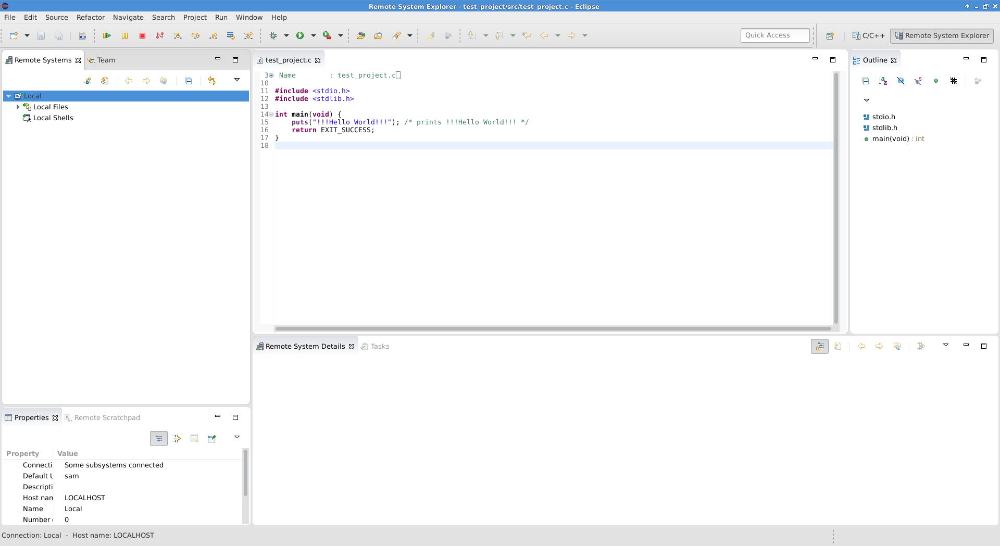


Als Remote System Type "Linux" wählen und auf Next klicken.
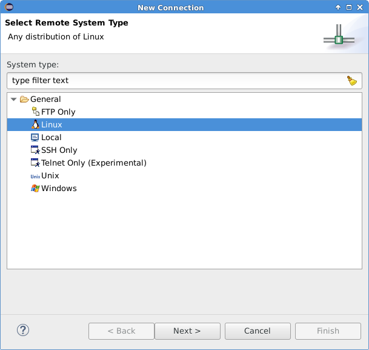

Im Feld "Host name" die IP-Adresse des Targets eingeben, einen "Connection name" vergeben und auf  "Next" klicken.
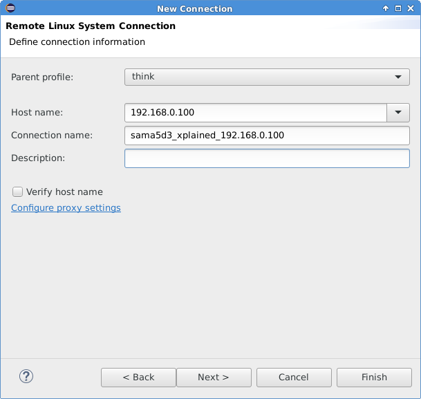

Im nächsten Dialog "ssh.files" anklicken um Dateizugriff per ssh zu konfigurieren. Weiter mit "Next".
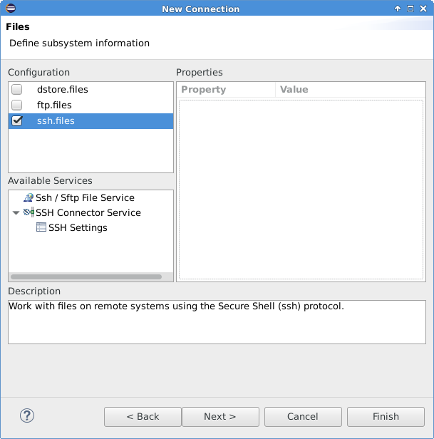

Im Dialog "processes.shell.linux" anklicken um Prozessinformationen per ssh zu erhalten. Weiter mit "Next".

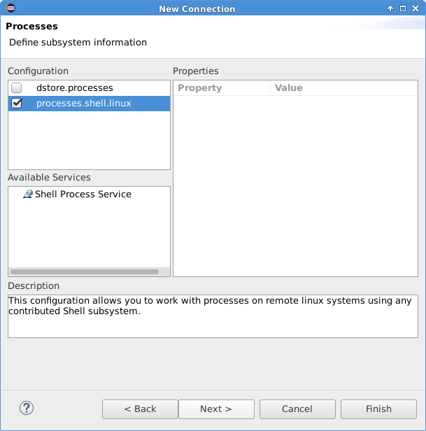

Im Dialog "ssh.shells" anklicken um Shellzugriff per ssh zu konfigurieren. Beenden mit "Finish".

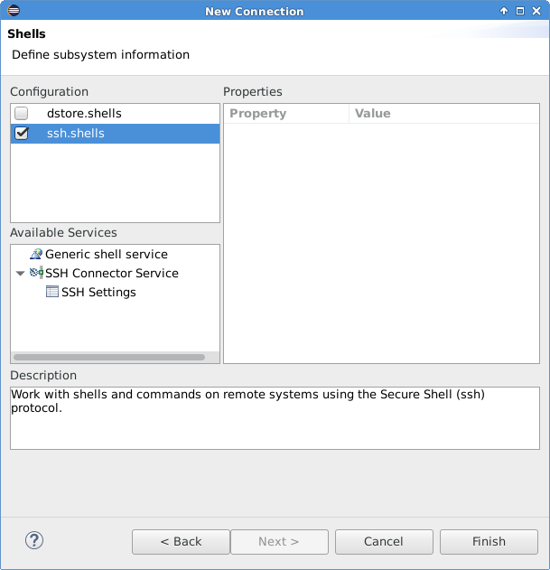


Im Tab "Remote systems" ist nun das Target als Remote system "sama5d3_xplained_192.168.0.100" zu sehen.

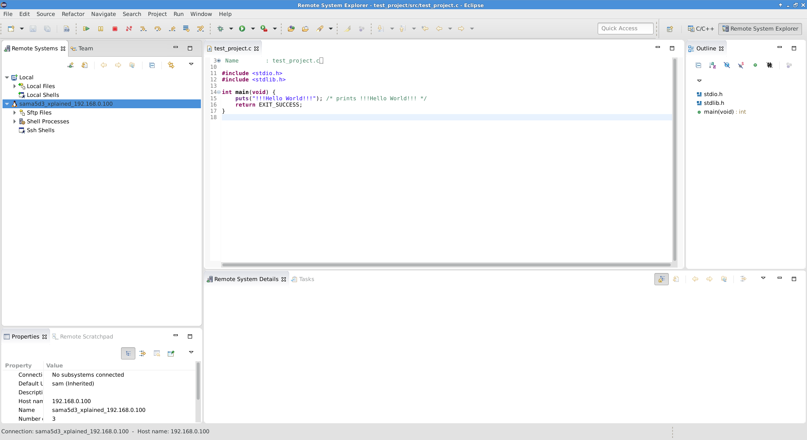

Durch Klicken auf "Sftp Files" und die folgenden Unterpunkte "My Home" oder "Root" wird eine SSH-Verbindung hergestellt. Der benutzername und das Passwort wird abgefragt und kann ggf. gespeichert werden.

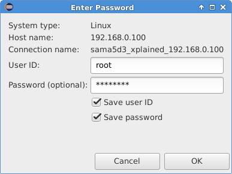

Nun kann das Dateisystem des Targets bequem durchsucht werden.

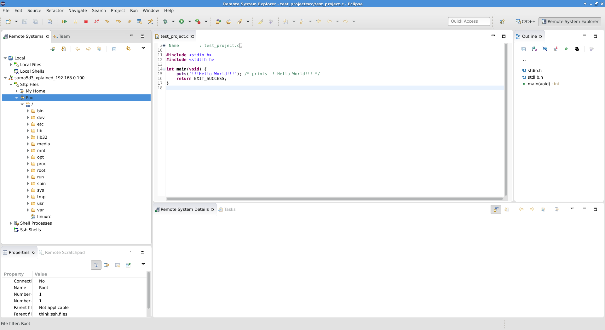

## Eine Debug-Konfiguration anlegen

Mittels "Window -> Perspective -> Open Perspective -> Other" die Auswahlliste der zur Verfügung stehenden Perspektiven aufrufen. Dort den "Debug" auswählen umd die Debug Perspektive zu öffnen.


Um nun das Programm auch direkt auf dem Target auszuführen, muss eine Debug / Run Konfiguration angelegt werden, die die eben erzeugte Remote System Connection verwendet. Dazu mittels des Menüs "Run -> Debug configurations..." den Konfigurationsdialog starten und per Doppelklick auf "C/C++ Remote Application" eine neue Konfiguration erzeugen

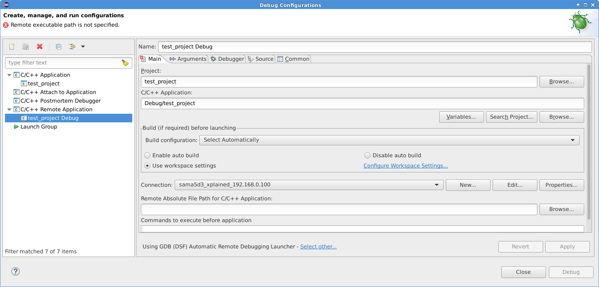


Im "Main"-Tab: Falls noch nicht die richtige "Connection:" ausgewählt ist, die eben erstellte per Drop-Down Feld auswählen. In das Feld "Remote Absolute File path for C/C++ Application" den Pfad eintragen, wohin das kompilierte Programm im Target kopiert werden soll.
Für den Fall, dass das Programm nicht ausführbar ist, den Befehle "chmod +x /root/test_project" in das Feld "Commands to execute before application" eintragen.

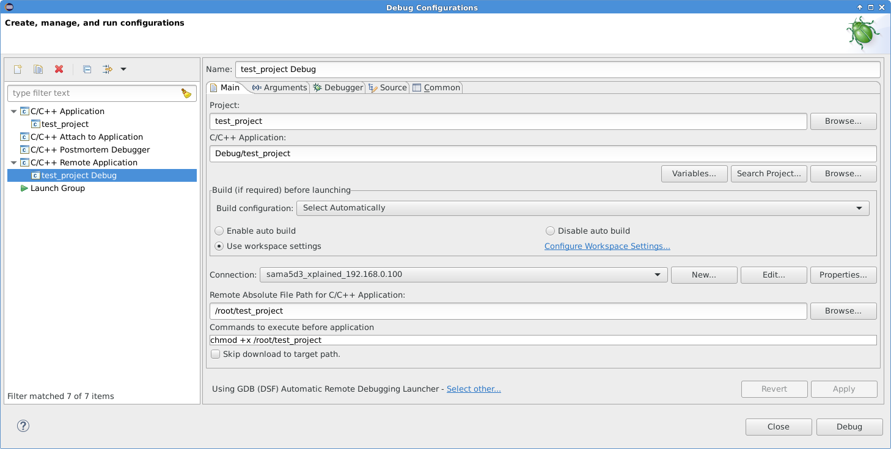

 Nun auf den Tab "Debugger" wechseln und den Pfad zum Cross-GDB im Feld "GDB debugger" eingeben. Nun auf "Apply" klicken um die Änderungen zu speichern und dann mit einem Klick auf "Debug" das Debugging starten und den Dialog schliessen.

 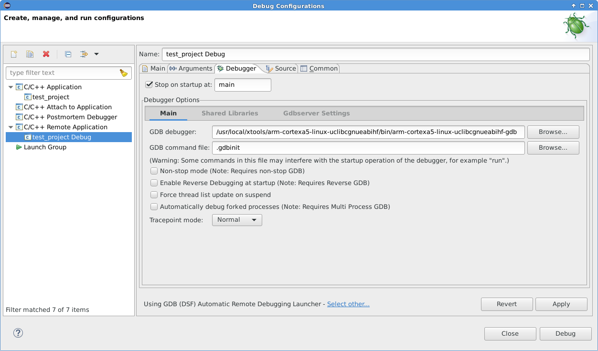

 Die Debug-Konfiguration kopiert das lokal cross-kompilierte Programm per sftp auf das Target, startet den gdbserver und verbindet den arm-cortexa5-linux-uclibcgnueabihf-gdb. Mit den Icons in der Menüleiste (oder F6 für "Step over") kann man nun durch das Programm gehen.

 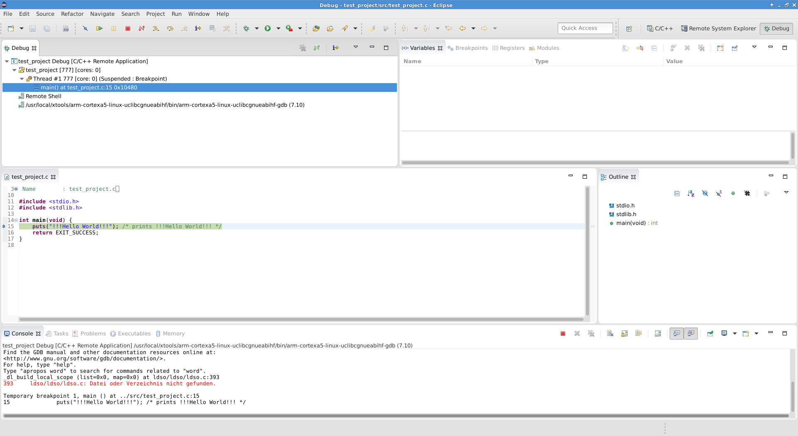
